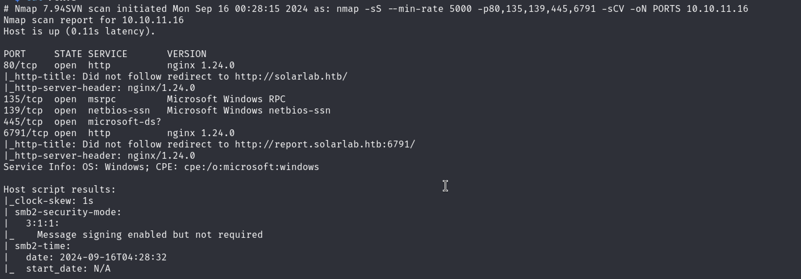

# Solarlab

## Escaneo Inicial

Usamos ***nmap*** con los siguientes comandos

```bash
sudo nmap -sS --min-rate 5000 -p- -Pn 10.10.11.16 -vvv -oN Ports
```



Descubrimos los puertos ***80, 135, 139, 445 y 6791*** abiertos asi que continuamos con la versiones y scripts con ***nmap***

```bash
nmap -sS --min-rate 5000 -p80,135,139,445,6791 -sCV -oN PORTS 10.10.11.16
```

Encontramos un subdomain en el puerto ***6791*** pero lo dejamos para mas tarde.

Continuamos observando la pagina web el puerto 80


No encontramos nada interesante asi que continuamos con el puerto ***6791***